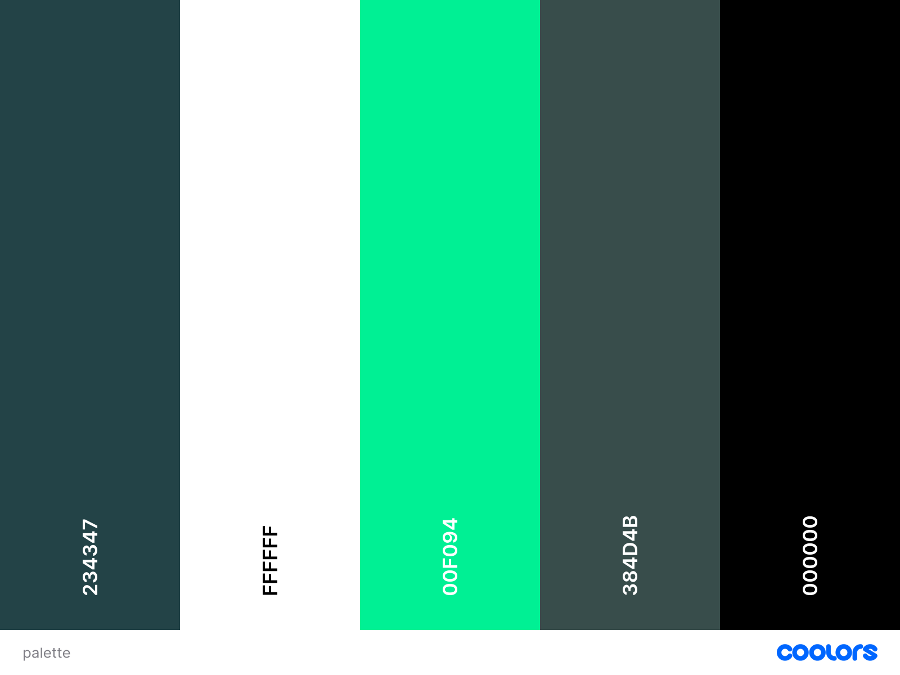

# TP1_Integration_Web_2 : site web de type ‘page unique’

Elève: Jeanne Pietropaoli

## Liens

Repo : https://github.com/jeannepietropaoli/TP1_Integration_Web_2

## Description

Le but est de créer un site web de type **page unique** pour l'entreprise de notre choix. 

   * Un peu plus sur l'entreprise choisie:

   Médailles Alpine est une entreprise de confection de médailles (notamment pou chiens) implantée à Québec. Le travail artisanal et la connexion avec le domaine canin en font une de mes entreprises locales favorites. Je n'en dis pas plus, vous en apprendrez assez sur le site !

## Apercu      

## Objectifs

*  Respecter les **maquettes filaires** données
*  Ecrire du **code HTML propre** et **accessible**
*  Pratiquer la méthodologie **BEM**
*  Se familiariser avec **SASS**
*  Créer des **formulaires** avec une bonne **validation en JS** et facilement compréhensible par l'utilisateur
*  Fournir un **site responsive**
*  Se familiariser avec **Github**

## Design

* ### Fonts :

  * Dosis (principale) [->](https://fonts.google.com/specimen/Dosis?query=dosis)
  * Roboto (titres) [->](https://fonts.google.com/specimen/Roboto)

* ### Palette de couleurs :

J'ai choisi un thème hivernal / forestier qui fitte avec le branding de l'entreprise, très tournée vers le plein air.

## Technologies utilisées

* HTML
* SASS
* JavaScript